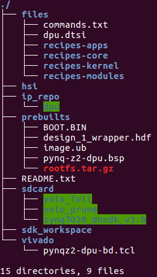
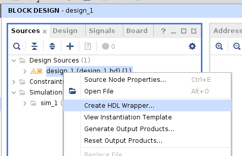
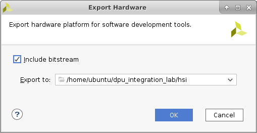
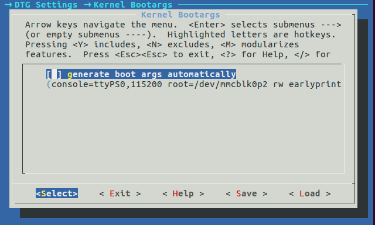

<table>
<tr>
  <td colspan="4" align="center"><h1>Edge AI Tutorials</h1>
  </td>
</tr>
<tr>
<td colspan="4" align="center"><h1>Zynq 7000 DPU TRD</h1>
</td>
</tr>
</table>

# Introduction

This tutorial demonstrates how to build a custom system that utilizes the 1.4.0 version of Xilinx&reg; Deep Learning Processor (DPU) IP to accelerate machine learning algorithms using the following development flow:

1. Build the hardware platform in the Vivado&reg; Design Suite.

2. Generate the Linux platform in PetaLinux.

3. Use Xilinx SDK to build two machine learning applications that take advantage of the DPU.

**Note:** The PYNQ-Z2 will be the targeted hardware platform. You can download all the things from Baidu Cloud Disk, the link is [here](https://pan.baidu.com/s/1gOJaoJJ8z2jf-BaLklID3Q).

# Requirements for Using the Xilinx DPU
This section lists the software and hardware tools required to use the Xilinx&reg; Deep Learning Processor (DPU) IP to accelerate machine learning algorithms.
## Software Requirements
* Vivado&reg; Design Suite 2018.3

* Board files for PYNQ-Z2 should be installed

* Xilinx SDK 2018.3
* PetaLinux 2018.3

## Hardware Requirements

* The PYNQ-Z2 board

* 12V power supply for PYNQ-Z2

* MicroUSB to USB-A cable

* A blank microSD card 

* Ethernet cable

**NOTE:** Petalinux use INITRAMFS within image.ub and BOOT.bin in one SD partition as default. But run DPU
Application may depend on multiple 3rd libs like OpenCV need very large space but limited by the INITRAMFS.
So we suggest use at least 16G SD card and format it with two partitions. The 1st partition is FAT32 should
enough for put BOOT.bin and image.ub that 128Mb shoulbe be good, rename to `BOOT`. the
2nd one should take up the remaining space, needs to be formatted with a ext4 filesystem, rename to `rootfs`.

# Project Archive
Download and extract the full tutorial archive from this repository and move the pynq-z2-dpu140/reference-files sub-directory to your working area. Rename this directory to "dpu_integration_lab". You should end up with a directory structure as shown in the following figure:



The folders are:

- **files:** Petalinux/Yocto recipes, source code for SDK, etc.

- **hsi:** Directory for handing off `.hdf` files from the Vivado Design Suite to PetaLinux

- **ip_repo:** Repository for the DPU IP

- **prebuilts:** Includes a  pre-built `.hdf` file exported from the Vivado Design Suite, and a complete set of files to boot from the SD card and run applications

- **sdk_workspace:** Empty Eclipse workspace to be used for Xilinx SDK application development

- **vivado:** The Vivado Design Suite working directory includes an archived project for PynqZ2 as well as a `.tcl` script to create a working `.bd`

- **sdcard:** Staging area for creating the SD Card image

From here, the location of the root lab directory will be referred to as ``<PROJ ROOT>``.

**TIP:** There is a file called commands.txt in the files directory, that has most of the commands required for the lab. Copy and paste the file from this location to save time.

## Vivado Design Suite

1. Create a new project for the PYQN-Z2.

2. Add the DPU IP to the project.

3. Use a `.tcl` script to hook up the block design in the IP integrator.

4. Examine the DPU configuration and connections.

5. Generate the bitstream.

6. Export the `.hdf` file.

## PetaLinux

1. Create a new PetaLinux project with the "Template Flow."

2. Add some new Yocto Recipes and recipe modifications.

3. Import the `.hdf` file from the Vivado Design Suite.

4. Configure some PYNQ-Z2-specifc hardware options.

5. Add some necessary packages to the root filesystem.

6. Update the device-tree to add the DPU.

7. Build the project.

8. Create a boot image.

# Building the Hardware Platform in the Vivado Design Suite

## Step 1: Create a project in the Vivado&reg; Design Suite

1. `cd` into the Vivado directory and launch Vivado.

```
source <path/to/vavido_installer>/settings64.sh
cd <PROJ ROOT>/vivado/
vivado
```

2. Create a new project based on the PYNQ-Z2 boards files:

     - Project Name: **project_1**

     - Project Location: `<PROJ ROOT>/vivado`

     - Do not specify sources

     - Select **pynq-z2**

      **Note:** The  PYNQ-Z2 Board Files are not a part of the standard Vivado installation. They must be installed separately. It is assumed that this step is already completed.

3. Click **Finish**.

## Step 2: Add the IP repository (containing the DPU IP) to the IP catalog
  1. Click **IP Catalog** in the Project Manager.

  2. Right-click **Vivado Repository** and select **Add Repository**.

  3. Select **<PROJ ROOT>/ip_repo**

  **Note:** You should see a message indicating that one repository and one IP is added.

## Step 3: Create the Block Design
  1. Open the TCL Console tab, `cd` to the `<PROJ ROOT>/vivado` directory, and source the `.tcl` script that has been provided to create the IP integrator block design for you:

```
source pynqz2_dpu_bd.tcl
```

  2. When the block design is complete, right-click on the **design_1** in the Sources tab and select **Create HDL Wrapper**.

  3. Accept the default options.

  

  4. Analyze the components and connections in the block design before continuing.

## Step 4: Copy the pre-built `.hdf` to the `hsi` directory (Optional)

  To use the pre-built option, execute the following command to copy the pre-built `.hdf` into the project:

```
cd <PROJ ROOT>
cp prebuilts/design_1_wrapper.hdf hsi
```

**Note:** To save time, we can skip building the Vivado project during this lab session and manually export a pre-built `.hdf` file to the directory where the PetaLinux flow expects it.

## Step 5: Generate the bitstream

1. Click **Generate Bitstream**.

2. Accept the defaults.

  **Note:** This step will take about 45 minutes, depending on the machine.

## Step 6: Export hardware

  When the bitstream generation process is complete, do the following steps to export the `.hdf` for use by PetaLinux:
  1. Click **File** > **Export** > **Export Hardware**.

  2. Make sure to include the bitstream.

  3. Export the hardware platform to `<PROJ ROOT>/hsi`.

  4. Click **OK**.

     

# Generating the Linux Platform in PetaLinux
You can begin with the PetaLinux flow, once the hardware definition file (`.hdf`) is exported from the Vivado&reg; Design Suite. At this point, you should have exported the `.hdf` to the `<PROJ ROOT>/hsi` directory.

**Tip:** To speed up text entry, use `commands.txt` file from the `<PROJ ROOT>/files` to copy and paste most of the commands. It is highly recommended that you copy and paste the commands to avoid command-line errors.

**Note:** All the commands are not available in the `commands.txt` file. Make sure you see this lab document for proper sequencing.

## Step 1: Create a PetaLinux project
```
source <path/to/petalinux-installer>/settings.sh
cd  <PROJ ROOT>
```

Use the following command to create a new PetaLinux project based on the Zynq template in a new directory named `petalinux`.
```
petalinux-create --type project --template zynq --name pynq-z2-dpu
cd pynq-z2-dpu
```

**Note:(Optional)** Use the following command to create a new Petalinux based on an existing BSP, then you can skip step 2 ~ 6.
```
petalinux-create --type project --source ./prebuilts/pynq-z2-dpu.bsp --name pynq-z2-dpu
cd pynq-z2-dpu
petalinux-config --get-hw-description=../hsi
```

## Step 2: Copy recipes to the PetaLinux project

In this step, you will add or edit some Yocto recipes to customize the kernel and rootfs and add the dnndk files.

**Note:** Make sure to `cd` in the PetaLinux directory first.

1. Add a `bbappend` to modify the `LINUX_VERSION_EXTENSION` of the kernel. This is required to make the pre-built `dpu` kernel module (`dpu.ko`) “version magic” match the kernel that we built. This step will not be necessary once the DPU kernel sources are integrated into the kernel build. Without this change, `dpu.ko` will fail to be inserted at boot.
```
cp -rp ../files/recipes-kernel project-spec/meta-user
```
2. Add a recipe to build  the DPU driver kernel module.
```
cp -rp ../files/recipes-modules project-spec/meta-user
```
3. Add a recipe to create hooks for adding an “austostart” script to run automatically during Linux init.
```
cp -rp ../files/recipes-apps/autostart project-spec/meta-user/recipes-apps/
```
4. Add a `bbappend` for the base-files recipe to do various things like auto insert the DPU driver, auto mount the SD card, modify the PATH, etc.
```
cp -rp ../files/recipes-core/base-files/ project-spec/meta-user/recipes-core/
```

## Step 3: Configure PetaLinux to install the `dnndk` files

```
vi project-spec/meta-user/recipes-core/images/petalinux-image.bbappend
```

  Add the following lines:

```
IMAGE_INSTALL_append = " autostart"
IMAGE_INSTALL_append = " dpu"
```

## Step 4: Point the PetaLinux build system to the `.hdf` file exported from the Vivado Design Suite

1. Use the following command to open the top-level PetaLinux project confguration GUI:

```
petalinux-config --get-hw-description=../hsi
```

2. Change the Boot from SD card and config Boootargs.

```
Image Packaging Configuration -> Root filesystem type (INITRAMFS) -> SD card
```


disable
```
DTG Settings -> Kernel Bootargs -> generate boot args automatically
```

and ehter the following bootargs in `user set kernel bootargs`
```
console=ttyPS0,115200 root=/dev/mmcblk0p2 rw earlyprintk quiet rootfstype=ext4 rootwait cma=256M
```


3. Exit and save the changes.  This step will take about 5-7 minutes.

## Step 5: Configure the rootfs

Use the following to open the top-level PetaLinux project configuration GUI.

```
petalinux-config -c rootfs
```

1. Enable each item listed below:

    **Filesystem Packages ->**
      - console -> utils -> pkgconfig ->
        - pkgconfig
      - devel -> make ->
        - make
      - misc ->
        - packagegroup-core-buildessential ->
          - packagegroup-core-buildessential

   **Petalinux Package Groups ->**
      - packagegroup-petalinux-opencv -> 
        - packagegroup-petalinux-opencv
        - packagegroup-petalinux-opencv-dev
      - packagegroup-petalinux-v4lutils ->  
        - packagegroup-petalinux-v4lutils
      - packagegroup-petalinux-x11 ->
        - packagegroup-petalinux-x11

    **Apps ->**
      - autostart

    **Modules ->**
      - dpu


2. Exit and save the changes.

**Tip:** For system-user.dtsi in step 6 and 7, you can copy and paste the amba node from `<PROJ ROOT>/files/dpu.dtsi`.
## Step 6: Add DPU to the device tree

At this time, the DPU is not supported by the device-tree generator. Therefore, we need to manually add a device-tree node to the DPU, based on our hardware settings.

At the bottom of `project-spec/meta-user/recipes-bsp/device-tree/files/system-user.dtsi`, add the following text(here we add the usb support together):

```
vi project-spec/meta-user/recipes-bsp/device-tree/files/system-user.dtsi
```

```
/include/ "system-conf.dtsi"
/ {
  amba_pl: amba_pl {
    #address-cells = <1>;
    #size-cells = <1>;
    compatible = "simple-bus";
    ranges ;
    dpu_eu_0: dpu_eu@4f000000 {
      clock-names = "s_axi_aclk", "dpu_2x_clk", "m_axi_dpu_aclk";
      clocks = <&misc_clk_0>, <&misc_clk_1>, <&misc_clk_2>;
      compatible = "deephi,dpu";
      interrupt-names = "dpu_interrupt";
      interrupt-parent = <&intc>;
      interrupts = <0 29 4>;
      reg = <0x4f000000 0x1000000>;
    };
    misc_clk_0: misc_clk_0 {
      #clock-cells = <0>;
      clock-frequency = <100000000>;
      compatible = "fixed-clock";
    };
    misc_clk_1: misc_clk_1 {
      #clock-cells = <0>;
      clock-frequency = <300000000>;
      compatible = "fixed-clock";
    };
    misc_clk_2: misc_clk_2 {
      #clock-cells = <0>;
      clock-frequency = <150000000>;
      compatible = "fixed-clock";
    };
  };
};
```

## Step 7: Add USB support

In step 6, we have already added usb support in device tree. We need to add usb support in kernel too. First run the following command:

```
petalinux-config -c kernel
```
1. Enable each item listed below:
    - Device Drivers -> Multimedia support -> Media USB Adapters ->
      - Media USB Adapters
      - USB Video Class
      - UVC input events device support
      - GSPCA based webcams (M)

2. Exit And Save

3. At the bottom of `project-spec/meta-user/recipes-bsp/device-tree/files/system-user.dtsi`, add the following text:

```
vi project-spec/meta-user/recipes-bsp/device-tree/files/system-user.dtsi
```

```
/{
 usb_phy0: usb_phy@0 {
  compatible = "ulpi-phy";
  #phy-cells = <0>;
  reg = <0xe0002000 0x1000>;
  view-port = <0x0170>;
  drv-vbus;
 };
};
&usb0 {
 dr_mode = "host";
 usb-phy = <&usb_phy0>;
};
```

## Step 8: Build the kernel and root file system

```
petalinux-build
```

## Step 9: Create the boot image

```
petalinux-package --boot --fsbl ./images/linux/zynq_fsbl.elf --fpga ./images/linux/system.bit --u-boot --force
```

## Step 10: Package the petalinux project into bsp

```
petalinux-package --bsp -p ./ -o pynq-z2-dpu.bsp
```

# Working with PYNQ-Z2

## Setting up PYNQ-Z2

Use the following steps to set up PYNQ-Z2:

1. Set the **Boot** jumper to the *SD* position. (This sets the board to boot from the Micro-SD card)
2. To power the board from the external 12V power regulator, set the **Power** jumper to the *REG* position.
3. Insert the Micro SD card loaded with the PYNQ-Z2 image into the **Micro SD** card slot underneath the board
4. Connect the USB cable to your PC/Laptop, and to the **PROG - UART** MicroUSB port on the board
5. Connect the Ethernet port


# Running Applications on PYNQ-Z2

Next, we’ll gather all the images in a SD card staging area first, and then copy them all to the SD card at one time.

## Step 1: Copy files to the SD card
Use the following steps to copy the files to the SD card:

1. Copy `<PROJ ROOT>/pynq-z2-dpu/images/linux/image.ub`, `BOOT.BIN` and `rootfs.tar.gz` to the `sdcard` directory.

```
cp ./images/linux/BOOT.BIN /media/$(whoami)/BOOT/
cp ./images/linux/image.ub /media/$(whoami)/BOOT/
```

2. Extract `rootfs.tar.gz` to `rootfs` ext4 partition
```
tar xzf ./images/linux/rootfs.tar.gz -C /media/$(whoami)/rootfs/
```

3. Copy `yolo` and `dnndk` to the `sdcard` and sync.
```
cp -r ../sdcard/* /media/$(whoami)/rootfs/home/root/
sync
```

## Step 2:	Boot the PYNQ-Z2
Place the micro SD card into the PYNQ-Z2 and power on the board. Once the board has booted, login using the following credentials:
- username = **root**
- password = **root**

## Step 3: Config the network

Run the commands below to config the network.

```
ifconfig eth0 192.168.2.99
```
**Note:** Config the ip with the same gateway, so you can connect the PYNQ-Z2 using ssh

## Step 4: Install DNNDK runtime and Bin

Change to the directory with the `zynq7020_dnndk_v3.0` and execute the `install.sh`.
```
cd /home/root/zynq7020_dnndk_v3.0
./install.sh
```
## Step 5:	Run the yolo3 app

Change to the following directories with the yolo application and execute the program.
```
cd /home/root/yolo_prune
./yolo ./images/ i
```

The result image window will pop up in your HOST.

**Note:** SSH to PYNQ-Z2 and enable X11 forword. Advance using MobaXterm which auto-enable X11 forward in default.
