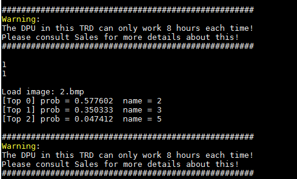

# Introduction

This tutorial introduces the deep neural network development kit (DNNDK) v3.0 TensorFlow design process and describes the process of creating a compiled `.elf` file that is ready for deployment on the Xilinx&reg; deep learning processor unit (DPU) accelerator from a simple network model built using Python.

In this tutorial, you will:

+ Train and evaluate a simple custom network using TF 1.9 (installed with DNNDK v3.0).
+ Remove the training nodes and convert the graph variables to constants. This is referred to as freezing the graph.
+ Evaluate the frozen model using the MNIST test dataset.
+ Quantize the frozen model using the DECENT_Q tool provided as part of the Xilinx DNNDK v3.0 suite.
+ Evaluate the quantized model using the MNIST test dataset.
+ Compile the quantized model to create the `.elf` file for execution on the DPU Accelerator IP.
+ Run your model in PynqZ2

# Prerequisites

The following are the prerequisites:

+ Ubuntu 16.04 platform with the following tools installed:
  + Anaconda 3
  + DNNDK v3.0
  + DECENT_Q. The version must be compatible with Python 3 since most scripts in this tutorial are based on Python3. For more information, refer to the <a href="https://www.xilinx.com/support/documentation/user_guides/ug1327-dnndk-user-guide.pdf">DNNDK v3.0 User guide (UG1327).</a>
+ Experience using Python3.
+ Familiarity with machine learning principles.
+ You should finish doing the build-host-dnndk.md & build-pynqz2-system.md before you continue.

# Getting Started

Clone or download the GitHub repository to your local machine where you have installed the required tools.

## Running the Tutorial using Scripts
This tutorial provides all of the necessary scripts to execute a design.

1. Open a terminal.
2. Run the `cd` command to move into the repository folder.
2. Run the complete flow using the ``source ./run_all.sh`` script.
3. Run each step individually using the following scripts as required:

   + ``source ./train.sh``   - Executes the training and evaluates the network using the CIFAR-10 dataset.
   + ``source ./freeze.sh``  - Creates the frozen graph in the `.pb` format.
   + ``source ./evaluate_frozen_graph.sh`` - Evaluates the quantized mode using the CIFAR-10 test dataset.
   + ``source ./quant.sh``   - Runs the `DECENT_q` for quantization.
   + ``source ./evaluate_quantized_graph.sh`` - Evaluates the quantized model using the CIFAR-10 test dataset.
   + ``source ./compile.sh`` - Runs the DNNC to create the `.elf` file.

> :pushpin: NOTES:
> 1. The `compile.sh` script targets the B1152 DPU. You might have to change this depending on the Zynq&reg; family device you are targeting.
> 2. Most of the shell scripts contain references to the Python virtual environment that was created using the `conda activate decent_q3` command during the installation of DECENT_Q. The name of your virtual environment can be different and the scripts must be modified to reflect this.

## Copy the files to your board
1. First copy the .elf file you built to mnist_tf/model/.
2. Copy the directory mnist-pynqz2 to your PynqZ2. You can use MobaXterm to copy.
3. In the board, `cd mnist-pynqz2`, run `make`.
4. Then `cp build/mnist ./`.
5. Run `./run.sh`. Now you can use your mouse to write a number, then press the button 'q' in keyboard to exit. You can see in the terminal that our network thinks the number is what you wrote most of the time. If you want to add your own functions please modify the main.cc in src directory and then make again.

The picture shows that mnist think it's number 2 rather than 3 or 5.

## Reference
[Docs](https://github.com/Xilinx/Edge-AI-Platform-Tutorials/tree/master/docs/MNIST_tf)
