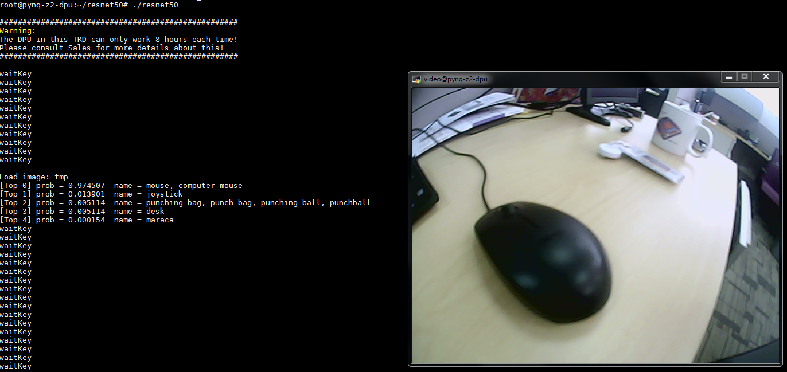

## First please make sure that you have finished doing the Caffe part in tutorial build-host-dnndk.md.

## Build the net  
  Use caffe to train resnet50.  
  Finally you will get a snapshot of the model, that's what we need. Here we provide you with the example structure of resnet50, you can find it in resnet50_host/float.prototxt, also the final output snapshot of caffe is float.caffemodel. We recommend you try your own network structure, but to save time, you can use the output we provided.  
  ***Tips when using caffe***
  - If you want to train using only CPU, change the solver_xxx.prototxt file. Make solver_mode:GPU to solver_mode:CPU.  
  - If you keep running into allc errors, you should reduce your batch size in caffe config.  
## Quantization
  Compress the neural network model (from the host side) using decent. Edit the decent_resnet50.sh if you can use gpu, change the decent-cpu to decent.  Run decent_resnet50.sh.  
  
## Compile
  Compile the neural network model (from the host side) using dnnc. Run dnnc_resnet50.sh. When finished you can see the .elf file in dnnc_output directory.  
  
## Copy the files to your board
  Before copying, replace the .elf files in resnet50_pynqz2/model with your .elf file generated just now. Also you can just use the provided .elf file.  
  The following as a list of the commands you could launch from the target (ex. static IP address 192.168.1.101) to the host (ex. static IP address 192.168.1.100). These examples assume that you have a folder named /root/resnet50 in the file system of the SD card on the target PynqZ2 board:
  ```sh
  (from host)
    scp -r quantize_results/* root@192.168.1.101:/resnet50_pynqz2/model/
  (from target)
    cd /resnet50_pynqz2/
    make clean
    make
    cp build/resnet50 ./
  ```  
## Run the hybrid application
  - First connect to your usb camera.
  - Connect to PynqZ2 using MobaXterm. If you don't know how to do this, please read build-pynqz20system.md one more time.
  - Start the resnet case:
    ```sh
    cd /resnet50_pynqz2/
    ./resnet50
    ```
  - When you want to use resnet50 to classify, press the button 's' in your key board and then you can see the result in your window.
  
